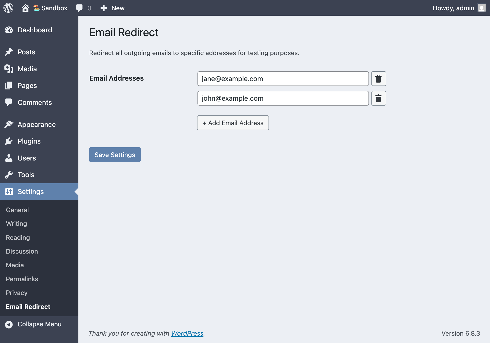

# Email Redirect

## Screenshot



## Setup Commands

```bash
composer install     # Install PHP dependencies
pnpm install         # Install Node.js dependencies
```

## Build Commands

```bash
pnpm build          # Build CSS and JS assets
pnpm build:css      # Build CSS from SCSS
pnpm build:js       # Build minified JS
pnpm build:watch    # Watch and build CSS on changes
pnpm build:zip      # Create distribution zip file
```

## Linting Commands

```bash
pnpm lint:css       # Lint SCSS files
pnpm lint:css:fix   # Fix SCSS linting issues
pnpm lint:js        # Lint JavaScript files
pnpm lint:js:fix    # Fix JavaScript linting issues
```

## Code Quality Commands

```bash
pnpm phpcbf         # Fix PHP coding standards issues
pnpm phpcs          # Check PHP coding standards
pnpm phpcs:file     # Check specific PHP file
pnpm phpcs:summary  # Show PHP coding standards summary
```

## Release Commands

```bash
pnpm release        # Bump version number and create distribution zip file
```
